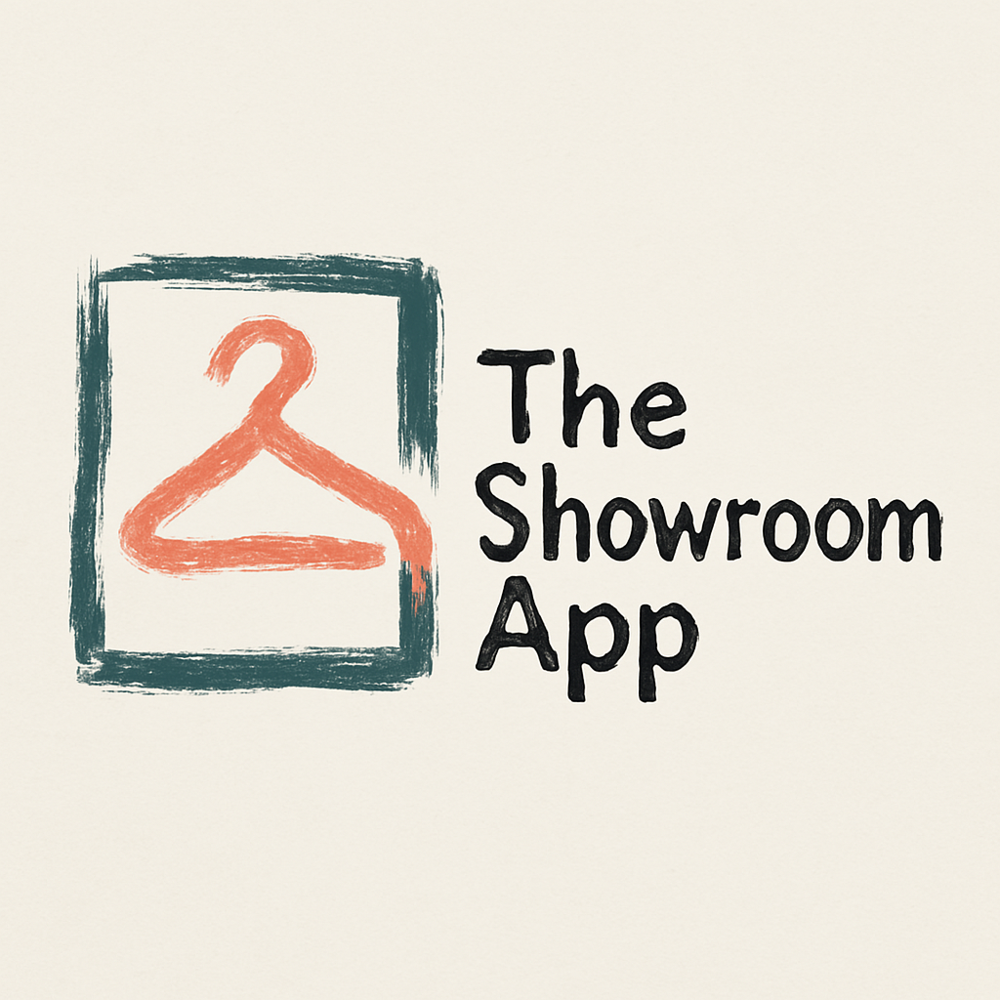

# The Showroom App



## 📋 Descripción

The Showroom App es una plataforma web desarrollada con Next.js y Tailwind CSS que conecta marcas de ropa con propietarios de showrooms. La plataforma permite a las marcas encontrar espacios para exhibir sus productos y a los propietarios de showrooms monetizar sus espacios de manera eficiente.

## ✨ Características principales

- **Para Marcas**: Explora y filtra showrooms, contacta espacios, exhibe productos y aumenta visibilidad
- **Para Showrooms**: Crea perfiles detallados, recibe solicitudes de marcas, gestiona exhibiciones y genera ingresos
- **Búsqueda avanzada**: Filtros por ubicación, estilo, capacidad y precio
- **Perfiles personalizables**: Tanto para marcas como para showrooms
- **Casos de éxito**: Historias reales que muestran el impacto de la plataforma
- **Blog integrado**: Tendencias, consejos y novedades del sector

## 🎨 Estilo y diseño

La estética de The Showroom App está inspirada en un estilo artesanal y creativo, con elementos que evocan el boceto a mano y trazos de pincel. La paleta de colores incluye:

- **Verde teal (#2D5C50)**: Color principal para bordes y elementos destacados
- **Coral (#E27863)**: Color de acento para llamadas a la acción y elementos interactivos
- **Beige claro (#F2EFDF)**: Color de fondo que proporciona calidez y elegancia

La tipografía combina fuentes manuscritas para títulos con fuentes sans-serif limpias para el cuerpo del texto, creando un equilibrio entre personalidad y legibilidad.

## 🛠️ Tecnologías

- **Frontend**: Next.js 15, React 19, Tailwind CSS 4
- **Backend**: (A implementar) Node.js/Express o Next.js API Routes
- **Base de datos**: (A implementar) PostgreSQL (según script incluido)
- **Autenticación**: (A implementar) NextAuth.js/Auth.js
- **Imágenes**: Optimización con next/image
- **Despliegue**: Preparado para Vercel

## 🚀 Inicio rápido

### Requisitos previos

- Node.js 18.17.0 o superior
- npm o yarn

### Instalación

1. Clona el repositorio:
   ```bash
   git clone https://github.com/tu-usuario/the-showroom-app.git
   cd the-showroom-app
   ```

2. Instala las dependencias:
   ```bash
   npm install
   # o
   yarn install
   ```

3. Inicia el servidor de desarrollo:
   ```bash
   npm run dev
   # o
   yarn dev
   ```

4. Abre [http://localhost:3000](http://localhost:3000) en tu navegador para ver la aplicación.

## 📁 Estructura del proyecto

```
├── app/                       # Carpeta principal de la aplicación (App Router)
│   ├── (auth)/                # Rutas relacionadas con autenticación
│   ├── (dashboard)/           # Rutas del dashboard (protegidas)
│   ├── marcas/                # Páginas de marcas
│   ├── showrooms/             # Páginas de showrooms
│   ├── como-funciona/         # Página explicativa
│   ├── blog/                  # Blog y artículos
│   ├── api/                   # API endpoints
│   ├── globals.css            # Estilos globales
│   ├── layout.js              # Layout principal de la aplicación
│   └── page.js                # Página de inicio
├── components/                # Componentes reutilizables
│   ├── ui/                    # Componentes básicos de UI
│   ├── layout/                # Componentes de estructura
│   ├── home/                  # Componentes específicos de la homepage
│   ├── marcas/                # Componentes específicos de marcas
│   ├── showrooms/             # Componentes específicos de showrooms
│   └── shared/                # Componentes compartidos
├── lib/                       # Utilidades y funciones auxiliares
├── public/                    # Activos estáticos
│   ├── images/                # Imágenes
│   └── icons/                 # Iconos
├── styles/                    # Estilos adicionales
├── next.config.mjs            # Configuración de Next.js
├── tailwind.config.js         # Configuración de Tailwind CSS
├── postcss.config.mjs         # Configuración de PostCSS
└── package.json               # Dependencias y scripts
```

## 🎯 Estado actual

### Completado
- ✅ Estructura base del proyecto
- ✅ Configuración de Tailwind CSS con tema personalizado
- ✅ Componentes de layout (Navbar, Footer)
- ✅ Página de inicio completa con todas las secciones
- ✅ Componentes reutilizables para la UI
- ✅ Estética y branding adaptados a la identidad visual de The Showroom App

### En progreso
- 🔄 Páginas interiores (detalle de showroom, marca, etc.)
- 🔄 Implementación de la autenticación
- 🔄 Integración con base de datos

### Próximas características
- ⏳ Sistema de mensajería entre marcas y showrooms
- ⏳ Dashboards para marcas y showrooms
- ⏳ Sistema de valoraciones y reseñas
- ⏳ Gestión de calendarios y disponibilidad
- ⏳ Pasarela de pagos
- ⏳ Notificaciones en tiempo real

## 📊 Modelo de datos

El proyecto está preparado para implementar dos modelos de base de datos:

- **PostgreSQL**: Para datos estructurados (usuarios, marcas, showrooms, etc.)
- **MongoDB**: Para funcionalidades de mensajería y chat en tiempo real

Los scripts de creación de las bases de datos están incluidos en la documentación del proyecto.

## 📝 Convenciones de código

- **Componentes**: Uso de componentes funcionales con hooks
- **Estilos**: Tailwind CSS para todos los estilos, con clases utilitarias
- **Importaciones**: Uso de alias `@/` para importaciones absolutas
- **Nomenclatura**: PascalCase para componentes, camelCase para funciones
- **Estética**: Adherencia a la paleta de colores y estilo visual definidos

## 🤝 Contribuir

1. Haz un fork del proyecto
2. Crea una rama para tu característica (`git checkout -b feature/amazing-feature`)
3. Haz commit de tus cambios (`git commit -m 'Add some amazing feature'`)
4. Haz push a la rama (`git push origin feature/amazing-feature`)
5. Abre un Pull Request

## 📄 Licencia

Este proyecto está bajo la Licencia MIT - ver el archivo [LICENSE.md](LICENSE.md) para más detalles.

## 📞 Contacto

The Showroom App - [@TheShowroomApp](https://twitter.com/TheShowroomApp) - info@theshowroomapp.com

Link del proyecto: [https://github.com/tu-usuario/the-showroom-app](https://github.com/tu-usuario/the-showroom-app)